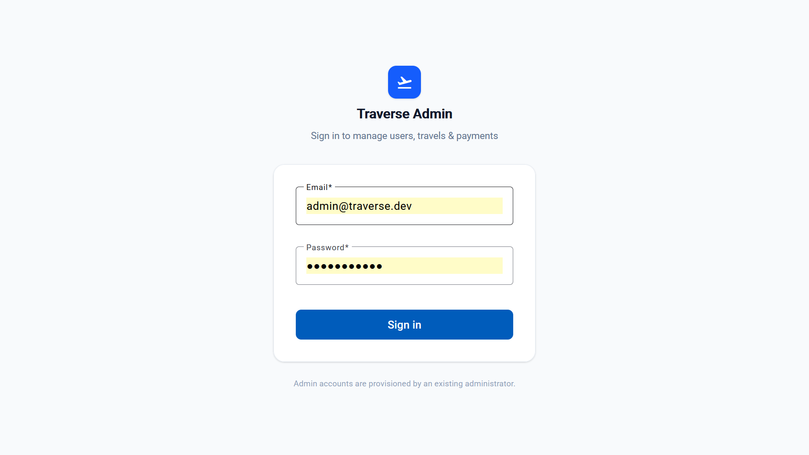
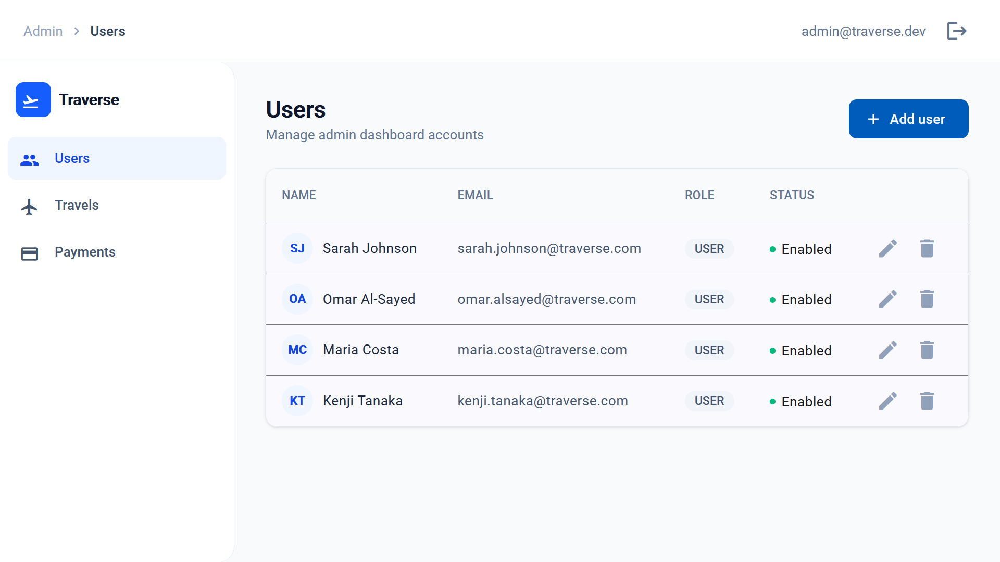
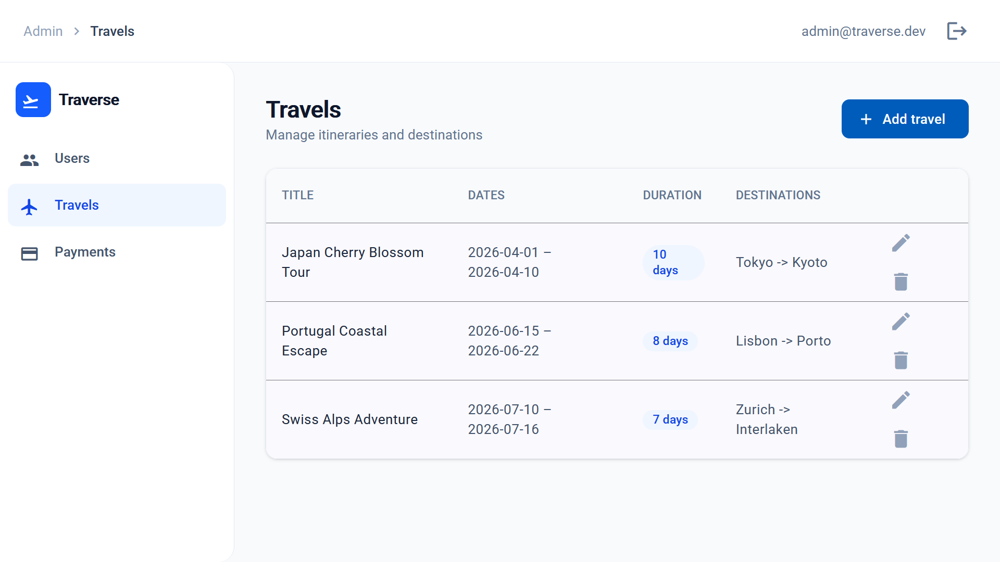
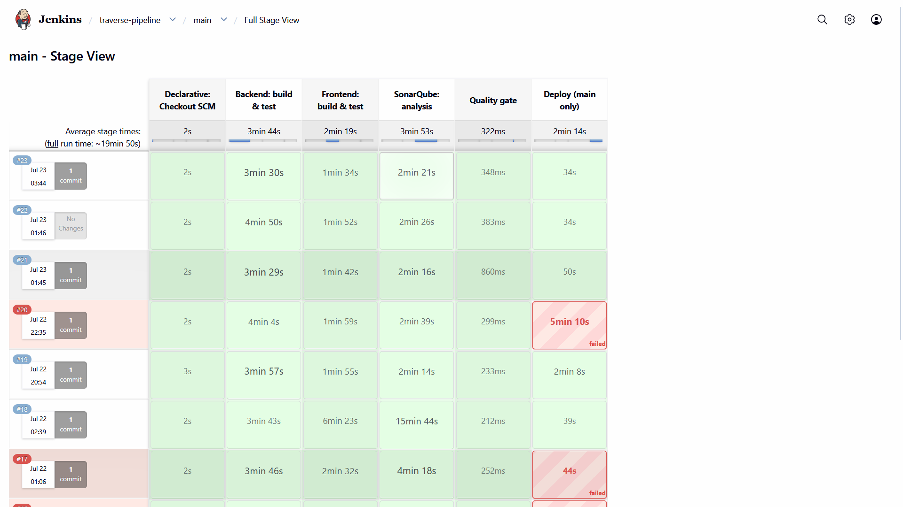
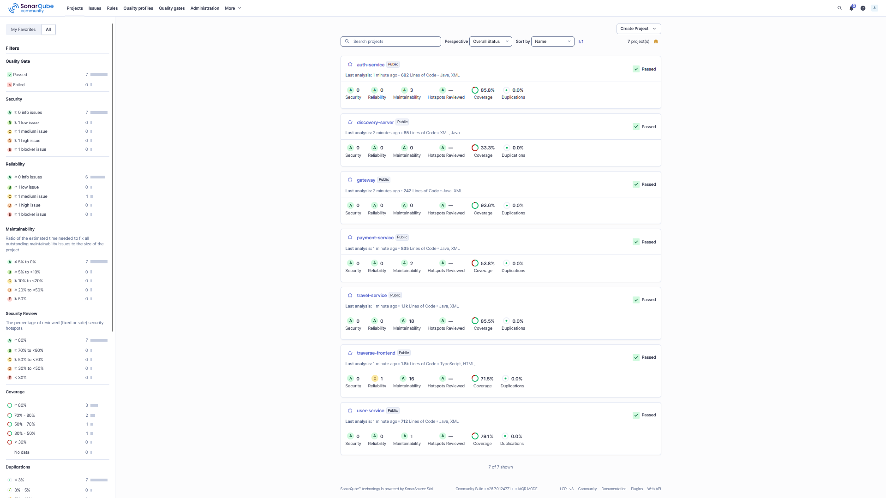
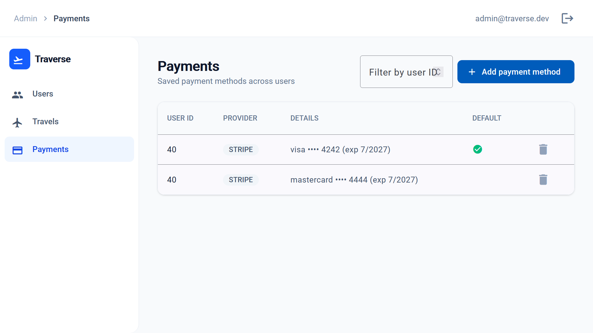
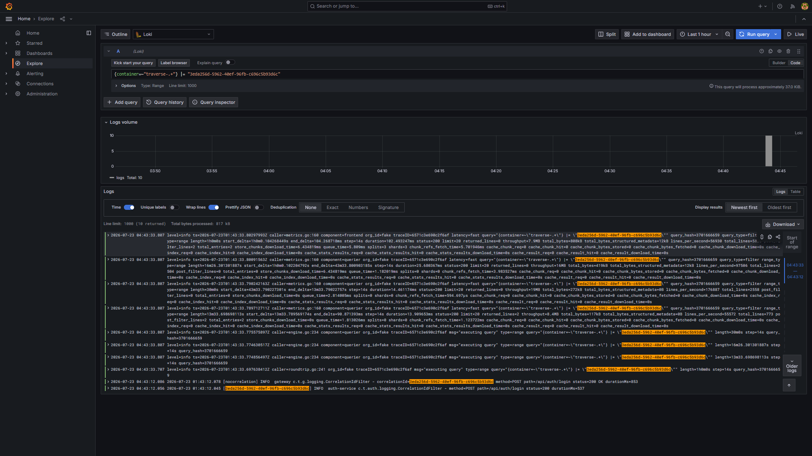
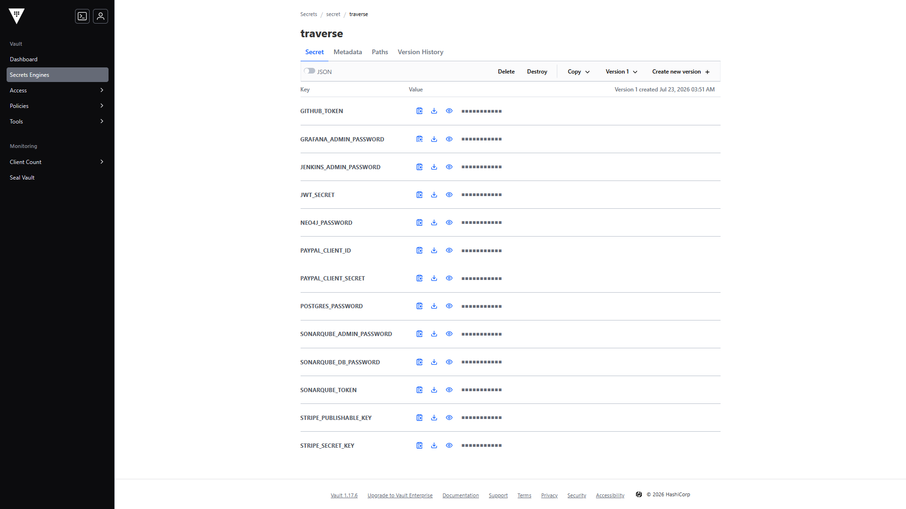
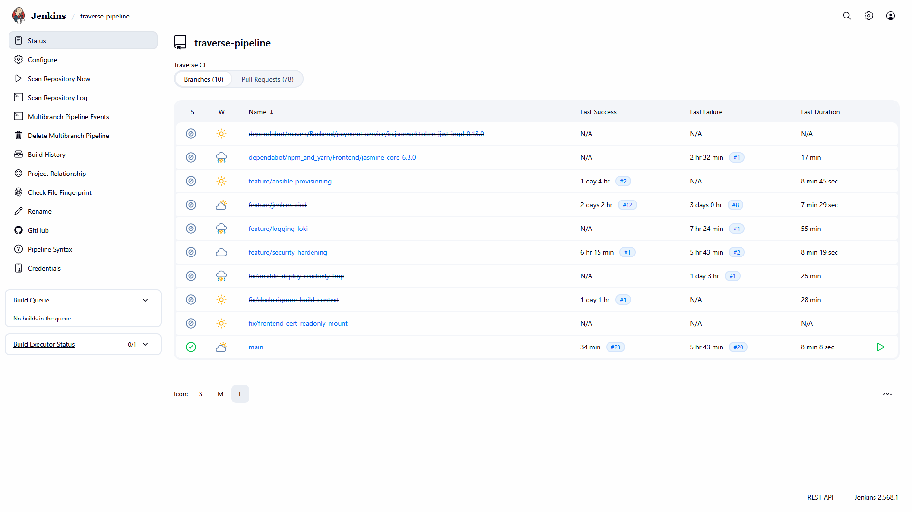

# Traverse — Travel Management System

A microservices-based Travel Management System with a secure **Admin
Dashboard** for managing users, travel itineraries, and payment methods —
built on an automated, scalable, observable infrastructure.

This repository is **Part 1**: the working environment (microservices,
databases, CI/CD, provisioning, logging, security) plus the Admin Dashboard.

---

## Highlights

- **6 Spring Boot microservices** + Angular dashboard, bounded by business
  domain, each independently deployable and scaled to **2 replicas** behind
  an API Gateway with **Eureka** service discovery and load balancing.
- **PostgreSQL** (transactional data, schema-per-service) + **Neo4j** (a
  destination-route graph for recommendations), both containerized.
- **CI/CD** with **Jenkins** (build, test, deploy on every branch/PR) and
  **SonarQube** (quality gate on 7 modules, all passing).
- **Ansible** playbooks for idempotent provisioning & deployment.
- **Centralized logging** with **Loki + Promtail + Grafana** and
  **correlation-ID request tracing** across services.
- **Security**: HTTPS/TLS, **HashiCorp Vault** secret management, non-root
  containers, network-isolated databases, JWT auth in an httpOnly/Secure/
  SameSite=Strict cookie, ADMIN-only APIs, Dependabot patching.
- **Stripe & PayPal** payment integration (cards tokenized client-side via
  Stripe Elements — raw card numbers never touch the backend).

## Screenshots

| Admin Dashboard | | |
|---|---|---|
|  |  |  |
| **Login (HTTPS)** | **Users CRUD** | **Travel with nested details** |

| CI/CD & Ops | | |
|---|---|---|
|  |  |  |
| **Jenkins pipeline** | **SonarQube 7/7 passed** | **Stripe payment methods** |

| Observability & Security | | |
|---|---|---|
|  |  |  |
| **Loki log tracing** | **Vault secrets** | **Per-branch CI** |

## Architecture

See **[docs/architecture.md](docs/architecture.md)** for the full runtime
architecture and **[docs/database-schema.md](docs/database-schema.md)** for
the data model (Postgres schemas + Neo4j graph).

```
Browser ──HTTPS──▶ Frontend (nginx) ──▶ API Gateway ──lb://──▶ Auth ×2
                                              │                 User ×2
                                       (JWT + correlation-id)   Travel ×2 ──▶ Neo4j
                                                                Payment ×2 ──▶ Stripe/PayPal
                                         all register with ──▶ Eureka
```

## Tech stack

Java 21 · Spring Boot 3.3 (Cloud Gateway, Eureka, Security, Data JPA, Data
Neo4j, OpenFeign) · Angular 19 · PostgreSQL 16 · Neo4j 5 · Jenkins ·
SonarQube · Docker Compose · Ansible · HashiCorp Vault · Loki/Promtail/
Grafana · k6.

---

## Getting started

### Prerequisites
- Docker Desktop (with Docker Compose)
- A `.env` file — copy `.env.example` to `.env` and fill in real values
  (DB passwords, JWT secret, Stripe/PayPal sandbox keys, tool passwords).

### Run the whole stack
```bash
docker compose up -d --build
```

Or, to deploy the way CI does (with TLS certs, Vault secret sync, and
2-replica scaling), use the Ansible playbook from a shell with Ansible +
Docker:
```bash
cd ansible
ANSIBLE_CONFIG=$(pwd)/ansible.cfg ansible-playbook playbooks/deploy.yml
```
Re-running is safe (idempotent). See [ansible/README.md](ansible/README.md).

### Access points

| Service | URL | Notes |
|---|---|---|
| **Admin Dashboard** | https://localhost (or https://127.0.0.1) | self-signed cert — accept the warning |
| API Gateway | via the dashboard's `/api` proxy | JWT-gated |
| Jenkins | http://localhost:8090 | CI/CD |
| SonarQube | http://localhost:9000 | code quality |
| Grafana | http://localhost:3000 | logs (Loki) |
| Vault | http://localhost:8200 | secrets (token auth) |
| Eureka | http://localhost:8761 | service registry |

> Postgres and Neo4j intentionally have **no host ports** (network
> restriction) — reach them via `docker exec` if needed.

### First login
The first account ever registered becomes `ADMIN`; register through the
dashboard to bootstrap it. Public registrations afterwards are `USER`, and
only an admin can create/promote users.

---

## Testing

- **Unit + integration tests** run on every build (backend: JUnit/Mockito/
  MockMvc; frontend: Karma/Jasmine on headless Firefox).
- **Load & failover tests** (k6) live in [loadtest/](loadtest/) — proving
  load balancing across replicas and failover under traffic.
- **CI-gated**: no PR merges into `main` without a green Jenkins pipeline
  (build + test + SonarQube quality gate).

## Repository layout

```
Backend/          6 Spring Boot services (discovery, gateway, auth, user, travel, payment)
Frontend/         Angular Admin Dashboard (+ nginx TLS/reverse-proxy)
ansible/          provisioning & deployment playbooks + roles
jenkins/          Jenkinsfile, Configuration-as-Code, custom image
logging/          Loki + Promtail + Grafana config
loadtest/         k6 load & failover scripts
certs/            (gitignored) Ansible-generated TLS cert
docs/             architecture, database schema, screenshots
docker-compose.yml
Plan.md           phase-by-phase build log
```

## Documentation

- [docs/architecture.md](docs/architecture.md) — services, discovery, auth,
  tracing, CI/CD, security
- [docs/database-schema.md](docs/database-schema.md) — Postgres + Neo4j
- [ansible/README.md](ansible/README.md) — playbooks & idempotency
- [loadtest/README.md](loadtest/README.md) — load/failover testing
- [certs/README.md](certs/README.md) — TLS / Let's Encrypt path
- [Plan.md](Plan.md) — the full phase-by-phase build log
